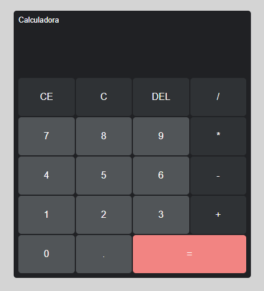

# Projeto-Calculadora

 Projeto criado para o curso de Java Script do Matheus Batisti (Youtube). Utilizando os métodos e tecnologias ensinadas.

 

 
 

## 🛠 Tecnologias 

- HTML

- CSS

- Java Script

- Github

 
 

## ✨Contato

nick_monalisa@outlook.com